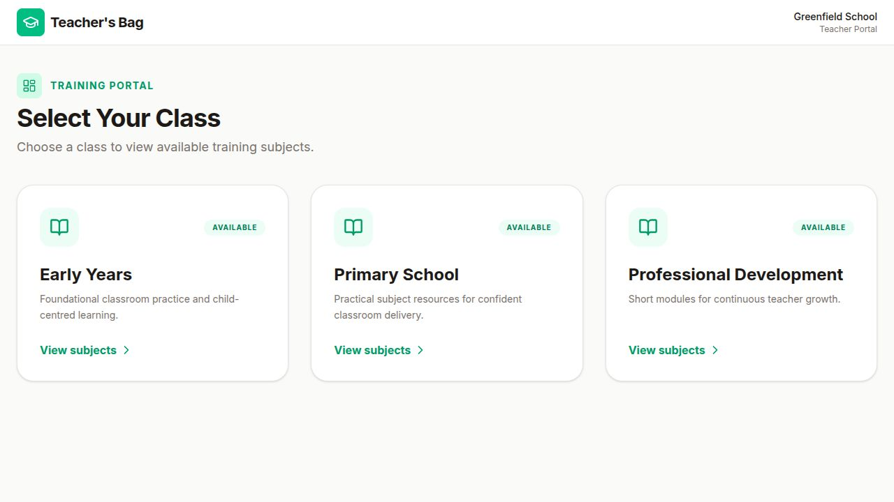
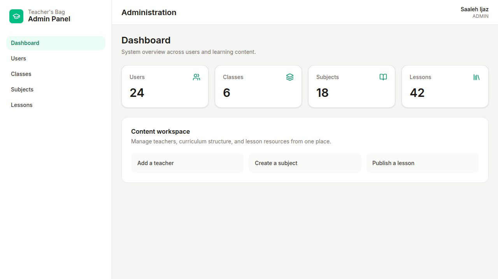
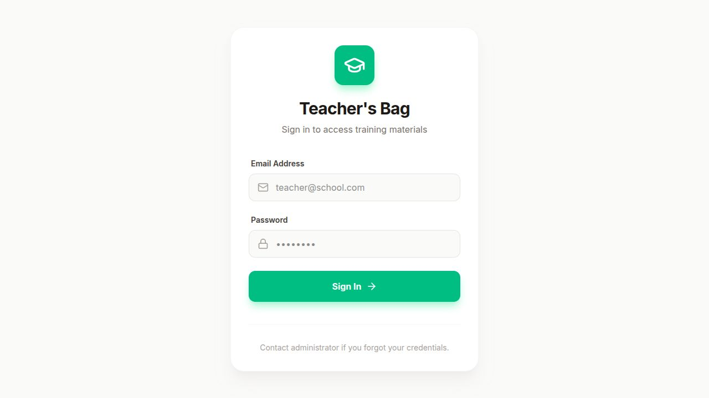

<div align="center">

# Teacher's Bag

### A focused training portal for teachers—and a practical workspace for the people who manage their learning content.

**React 19 · TypeScript · Firebase Auth · Cloud Firestore · Tailwind CSS**

</div>



> The screenshots use representative sample content; no real user or school data is included.

## Why this project exists

Training resources often become fragmented across folders, messages, links, and individual devices. Teacher's Bag brings that material into one role-aware application: teachers move through structured classes, subjects, and video lessons, while administrators manage the content and accounts behind the experience.

This is a functional portfolio project, not a static interface concept. It includes authentication, protected routes, persisted per-user progress, Firestore-backed content, an administrative workspace, security rules, deployment configuration, and automated checks.

## Product experience

| Teacher portal | Administration |
| --- | --- |
| Browse classes and subjects | View a system overview |
| Open curated video lessons | Create teacher accounts |
| Track lesson completion | Manage classes and subjects |
| Resume and review material | Publish and organize lessons |

### Administrative workspace



### Secure sign-in



## Engineering highlights

- **Role-aware navigation:** authenticated teachers and administrators enter separate route hierarchies.
- **Protected data:** Firestore rules deny unmatched access and reserve content management for administrators.
- **Safe profile updates:** teachers cannot promote their own account or change identity fields through Firestore.
- **Progress persistence:** lesson completion is stored per user and reflected across the lesson experience.
- **Operational admin workflow:** administrators can manage users, classes, subjects, and lesson records.
- **Responsive UI:** teacher and admin areas adapt to desktop and smaller screens without forcing device orientation.
- **Lazy-loaded routes:** feature screens are split from the initial application route.
- **Defensive UX:** configuration, loading, empty, and recoverable failure states are presented in the interface.
- **Normalized video links:** YouTube watch, short, embed, live, and direct-ID formats are handled consistently.

## Architecture

```text
Firebase Authentication
          │
          ▼
    Profile + role
          │
     ┌────┴────┐
     │         │
  Teacher    Admin
     │         │
 Classes    Users
 Subjects   Classes
 Lessons    Subjects
 Progress   Lessons
     │         │
     └────┬────┘
          ▼
    Cloud Firestore
```

The browser client handles presentation and authenticated workflows. Firebase Authentication establishes identity, while Firestore documents store roles, curriculum data, and user-specific completions. Authorization is enforced again in `firestore.rules`; the interface alone is never treated as the security boundary.

## Data model

```text
classes/{classId}
subjects/{subjectId}
materials/{materialId}
users/{uid}
└── completions/{materialId}
```

User documents contain the role used by the application and rules. Administrator access must be assigned deliberately in Firestore; it is not inferred from a client-side email list.

## Local setup

### Requirements

- Node.js 20 or newer
- npm
- A Firebase project with Email/Password Authentication and Cloud Firestore enabled

### Install and configure

```bash
npm install
cp .env.example .env.local
```

Add your Firebase web app values to `.env.local`, then start the application:

```bash
npm run dev
```

The app shows a clear configuration screen when required Firebase values are missing.

## Quality checks

Run the full local verification sequence:

```bash
npm run check
```

That command performs TypeScript checking, runs the unit tests, and creates a production build. Individual commands are also available:

```bash
npm run lint
npm run test
npm run build
```

The current tests cover role resolution and supported YouTube URL normalization. The most important authorization invariant—preventing a teacher from changing their own role—is also enforced directly in the checked-in Firestore rules.

## Deployment

Firebase Hosting, Firestore rules, and index configuration are included.

```bash
firebase deploy --only firestore:rules,firestore:indexes
npm run build
firebase deploy --only hosting
```

See [DEPLOYMENT.md](DEPLOYMENT.md) for environment variables, admin bootstrap, and the post-deployment smoke checklist.

## Project status

The primary teacher and administrator journeys are implemented and the project builds cleanly. Before using it for a real organization, add environment-specific monitoring, broader integration tests, a password-reset workflow, and an auditable server-side process for account administration.

## Author

Built by **Saaleh Ijaz** as a practical full-stack portfolio project.

[GitHub profile](https://github.com/Sahil-Rajpoot-AiPy) · [LinkedIn](https://www.linkedin.com/in/saaleh-ijaz-aipy/)
